# MLOps Assignment 01 — End-to-End Heart Disease Risk API

**Course:** AIMLCZG523 · Machine Learning Operations
**Author:** Kanna TJ (2024ad05219@wilp.bits-pilani.ac.in)
**Repository:** https://github.com/kannatj/MLOPS_HeartDiseaseRiskPrediction
**Deployed API:** Local only — Docker Compose (`:8000`) or local Kubernetes; run/access instructions in Section 2, Section 8, Section 9
**Video walkthrough:** [Google Drive recording](https://drive.google.com/file/d/1qjICf70Oy9uqdeHjkB8t8By39OI_V1f0/view?usp=sharing) — *Access restricted: only members of BITS Pilani can view this recording.*

---

## 1. Project overview

A production-ready pipeline that predicts the risk of heart disease for a patient using
the UCI Heart Disease dataset (920 patients, 14 clinical features). The solution covers
every stage of the MLOps lifecycle:

1. **Data & EDA** — reproducible dataset download, missing-value handling, feature
   analysis.
2. **Modelling** — Logistic Regression, Random Forest and XGBoost tuned with
   `GridSearchCV` (5-fold stratified CV, ROC-AUC as selection metric).
3. **Experiment tracking** — MLflow file store logging params, metrics, model
   artefacts, confusion matrix and ROC plots for every run.
4. **Packaging** — one `sklearn.Pipeline` containing preprocessing + estimator, saved
   as `heart_model.joblib` and referenced by the API.
5. **CI/CD** — GitHub Actions runs lint → pytest (+coverage) → smoke training →
   Docker build + `/health` + `/predict` probe.
6. **Containerisation** — multi-stage Dockerfile, non-root runtime.
7. **Deployment** — Kubernetes `Deployment` (2 replicas), `Service`, `Ingress`, `HPA`,
   plus an equivalent Helm chart.
8. **Monitoring** — structured request logs, Prometheus metrics (`/metrics`) and a
   Grafana dashboard bundled via `docker-compose`.

## 2. Setup & install instructions

```bash
git clone https://github.com/kannatj/MLOPS_HeartDiseaseRiskPrediction.git
cd MLOPS_HeartDiseaseRiskPrediction
python -m venv .venv && source .venv/bin/activate
pip install -r requirements-dev.txt
python data/download_data.py     # verifies data/raw/heart_disease_uci.csv
```

Common tasks:

| Task | Command |
|---|---|
| Lint | `make lint` (`ruff check src tests`) |
| Test | `make test` (`pytest --cov=src`) |
| Train | `make train` (writes MLflow runs + `models/heart_model.joblib`) |
| Serve locally | `make serve` (Swagger UI at http://127.0.0.1:8000/docs) |
| CLI inference | `python -m src.predict --json '{"age": 63, "sex": "Male", "cp": "typical angina"}'` |
| Docker build/run | `make docker-build && make docker-run` |
| Local monitoring stack | `make compose-up` (Grafana `:3000`, Prometheus `:9090`) |
| Kubernetes | `kubectl apply -f k8s/` |

The project is published as a public GitHub repository:

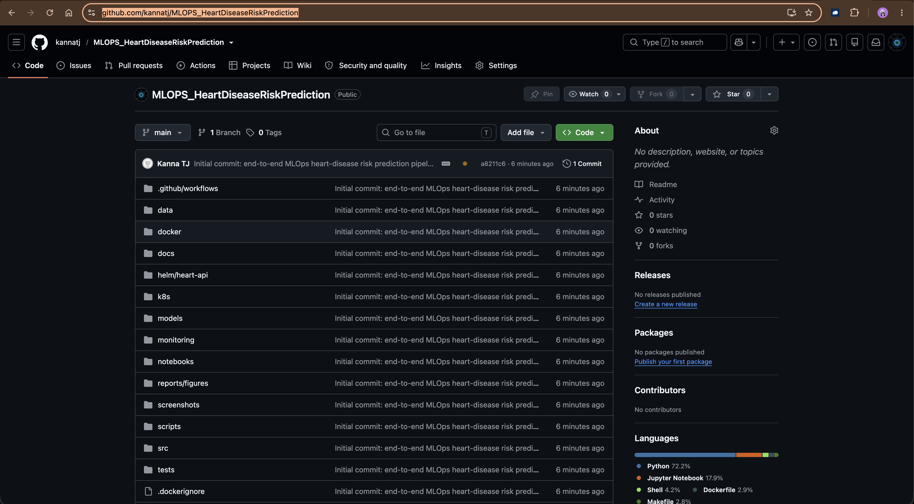

*Figure: repository root — code, notebooks, Docker, Helm, k8s, monitoring, tests and
CI workflow, with the language breakdown (Python, Jupyter, Shell, Dockerfile).*

## 3. EDA findings

*See `notebooks/01_eda.ipynb` and `reports/figures/`.*

Key observations:

- **Shape:** 920 rows, 16 raw columns from four hospitals (Cleveland, Hungary,
  Switzerland, VA Long Beach).
- **Class balance:** the engineered binary target `target = (num >= 1)` is mildly
  imbalanced (~55% disease, ~45% no-disease). Stratified splits and stratified k-fold
  CV keep the class ratio stable across folds.
- **Missingness:** substantial in `ca`, `thal`, `slope`, and moderate in `chol`,
  `trestbps`, `thalch`. This drives the choice of imputers inside the pipeline.
- **Strongest signal:** `oldpeak`, `thalch`, `ca`, `age`, and categorical `cp`
  (chest-pain type), `exang`, `thal`.
- **Hospital effect:** disease prevalence differs across `dataset`; retained as a
  one-hot feature.

The full set of EDA visualisations (missing-value matrix, class-balance bar chart,
numeric-feature histograms, categorical-vs-target plots and the correlation heatmap)
is produced and displayed inline in `notebooks/01_eda.ipynb`. The per-model
diagnostic plots that feed the modelling discussion are exported to
`reports/figures/` (confusion matrices and ROC curves for all three models).

## 4. Modelling choices

**Preprocessing** (`src/data_preprocessing.py`) — a `ColumnTransformer` inside a single
`Pipeline`:

- Numeric features (`age, trestbps, chol, thalch, oldpeak, ca`): median-impute →
  `StandardScaler`.
- Categorical features (`sex, dataset, cp, fbs, restecg, exang, slope, thal`):
  most-frequent impute → `OneHotEncoder(handle_unknown="ignore")`.

**Models & hyperparameter grids** (`src/train.py`):

| Model | Grid |
|---|---|
| Logistic Regression | `C ∈ {0.01, 0.1, 1, 10}`, `penalty ∈ {l1, l2}` (liblinear) |
| Random Forest | `n_estimators ∈ {200, 400}`, `max_depth ∈ {None, 6, 10, 16}`, `min_samples_split ∈ {2, 4, 8}` |
| XGBoost | `n_estimators ∈ {200, 400, 600}`, `max_depth ∈ {3, 4, 6, 8}`, `lr ∈ {0.03, 0.1, 0.2}`, `subsample ∈ {0.7, 0.9, 1.0}` |

Selection metric: **stratified 5-fold `roc_auc`**. All models are refit on the full
training set and evaluated on a held-out 20% test split for accuracy, precision,
recall, F1, ROC-AUC and average precision.

**Model comparison** (from `models/metrics.json`, held-out 20% test split):

| Model | CV ROC-AUC | Test ROC-AUC | Test F1 | Test Accuracy |
|---|---|---|---|---|
| Logistic Regression | 0.8921 | 0.9175 | 0.8692 | 0.8478 |
| **Random Forest (best)** | 0.8874 | **0.9287** | **0.8704** | 0.8478 |
| XGBoost | 0.8595 | 0.9026 | 0.8612 | 0.8424 |

The best-performing model (**Random Forest**, test ROC-AUC 0.9287) is persisted at
`models/heart_model.joblib` and consumed by the API at startup.

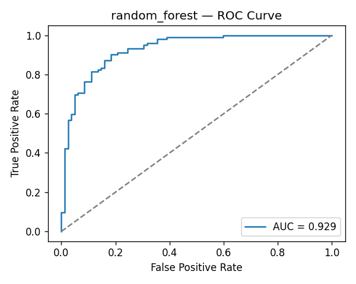

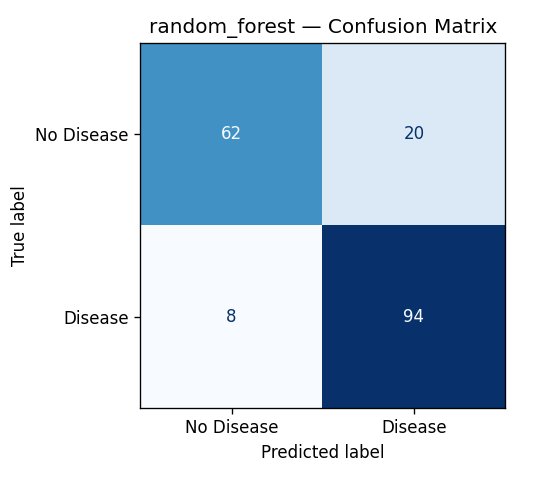

## 5. Experiment tracking summary (MLflow)

- **Tracking URI:** local file store at `./mlruns`.
- **Experiment:** `heart-disease-classification`.
- **Logged per run:** best hyperparameters, all six evaluation metrics, confusion
  matrix PNG, ROC curve PNG, joblib model, sklearn flavour model.
- **Additional "best_model" run:** convenience run that duplicates the top model with
  the tag `role=best_model`.

Screenshots (captured from the live MLflow UI, `screenshots/evidence/ui/`):

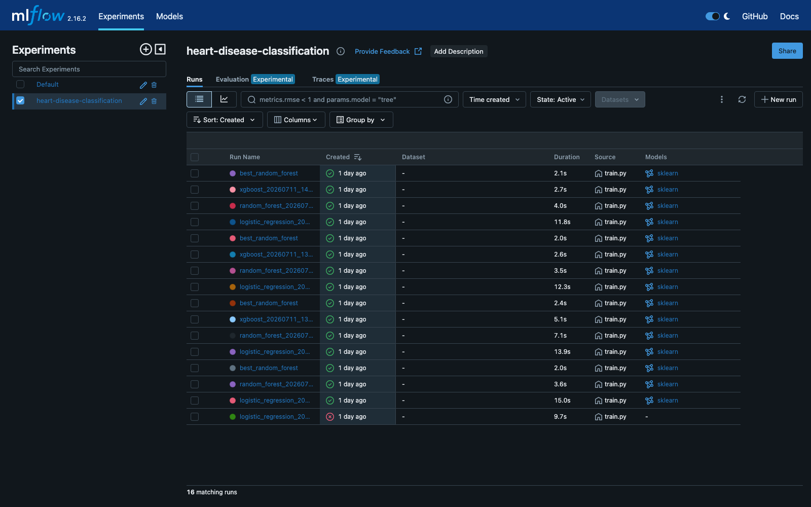

*Figure: 16 tracked runs across Logistic Regression, Random Forest and XGBoost.*

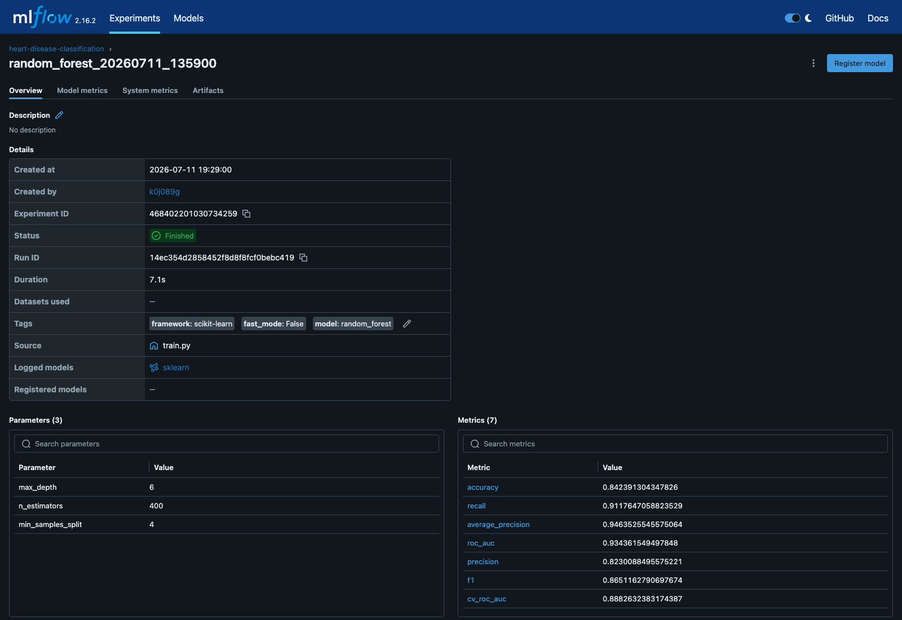

*Figure: parameters and the seven logged metrics for the best Random Forest run.*

## 6. Reproducibility

- `requirements.txt` pins every runtime dependency (major versions frozen).
- `requirements-dev.txt` adds test + lint + notebook tooling.
- `sklearn.Pipeline` ensures the exact same preprocessing runs at training and
  inference time — no drift between notebook and API.
- Random seeds are centralised in `src/config.py::RANDOM_STATE = 42`.
- Dataset SHA-256 is printed by `data/download_data.py`.

## 7. CI/CD workflow

`.github/workflows/ci.yml` runs on every push / PR to `main`:

1. **`lint-test-train`** — set up Python 3.11, install deps, run `ruff`, run
   `pytest --cov`, execute `python -m src.train --fast` to prove the training
   pipeline still works end-to-end, upload the trained model + coverage as build
   artefacts.
2. **`docker-build`** (needs job #1) — downloads the trained model, builds
   `heart-api:ci` via `docker/build-push-action` with a GitHub Actions cache, starts
   the container, probes `/health` and posts a sample payload to `/predict`.

The pipeline fails hard on lint errors, test failures, training errors, or a
non-200 response from the containerised API.

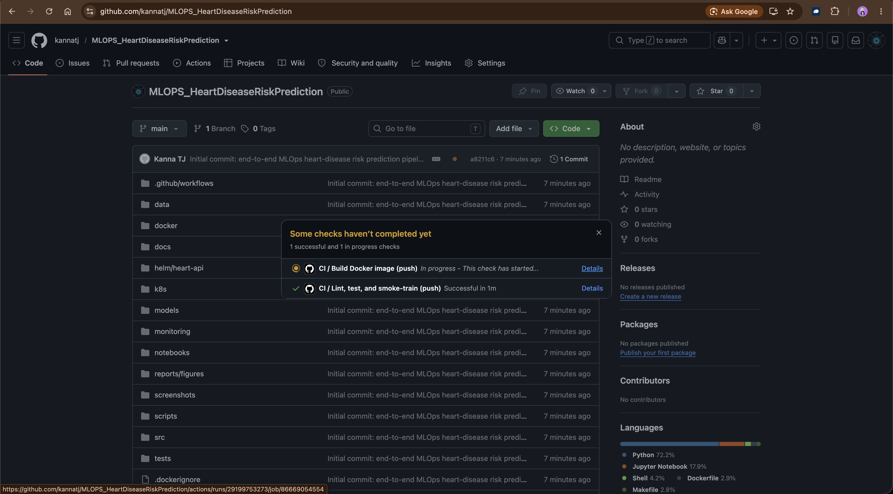

*Figure: GitHub Actions on push to `main` — "Lint, test, and smoke-train" succeeded,
"Build Docker image" job running.*

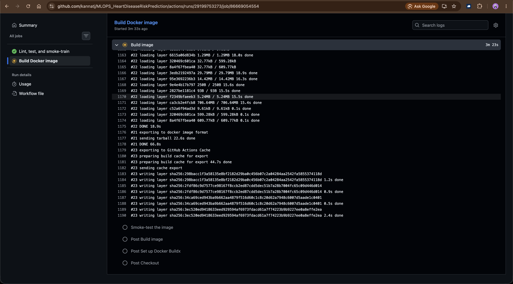

*Figure: the `docker-build` job building the image and smoke-testing the container in CI.*

## 8. Containerisation

`docker/Dockerfile` uses a two-stage build:

1. **Builder** (`python:3.11-slim`) — installs build toolchain, then
   `pip install --prefix=/install -r requirements.txt`.
2. **Runtime** — copies only the site-packages, source code, and trained model into
   a non-root user's home. Adds a `HEALTHCHECK` against `/health`.

Local usage:

```bash
docker build -f docker/Dockerfile -t heart-api:latest .
docker run --rm -p 8000:8000 heart-api:latest
```

Proof of a working isolated build/run is captured in
`screenshots/evidence/06_docker_build.txt`, `07_docker_run.txt` and
`08_docker_logs.txt`. The interactive Swagger UI served by the container:

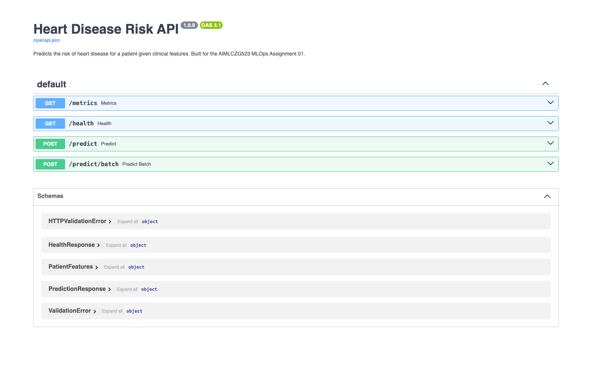

*Figure: interactive Swagger UI (`/docs`) served directly by the container.*

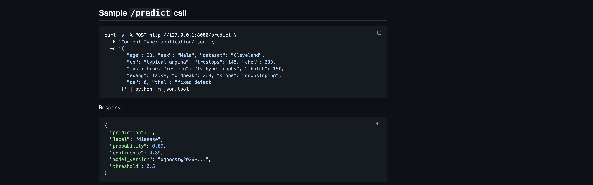

*Figure: a sample `/predict` request/response against the running API.*

## 9. Kubernetes deployment (Docker Desktop)

Manifests in `k8s/`:

- `namespace.yaml` — `heart-disease` namespace
- `deployment.yaml` — 2 replicas, readiness/liveness probes on `/health`, resource
  requests/limits, Prometheus scrape annotations
- `service.yaml` — ClusterIP on port 80 → container 8000
- `ingress.yaml` — nginx ingress at `heart-api.localhost`
- `hpa.yaml` — HPA scaling 2→5 pods at 70% CPU

```bash
docker build -f docker/Dockerfile -t heart-api:latest .
kubectl apply -f k8s/
kubectl -n heart-disease rollout status deploy/heart-api
kubectl -n heart-disease port-forward svc/heart-api 8000:80
# → http://127.0.0.1:8000/docs
```

Screenshots / evidence:

- `screenshots/evidence/11_k8s_deploy.txt` — `kubectl get deploy,pods,svc,hpa` with
  2/2 pods Running, ClusterIP Service and the HPA (2→5 replicas)
- `screenshots/evidence/12_k8s_predict.txt` — live `/health` and `/predict` responses
  served through the Kubernetes Service

## 10. Monitoring & logging

- **Structured request logs** — every HTTP call is logged with method, path, status
  code, duration and client IP.
- **`/metrics` (Prometheus)** — exposes standard `http_requests_total`,
  `http_request_duration_seconds`, plus two custom metrics:
  - `heart_predictions_total{label}` — counter of predictions grouped by outcome
  - `heart_prediction_latency_seconds` — histogram of `/predict` latency
- **Grafana** — a provisioned dashboard (`monitoring/grafana/provisioning/dashboards/heart-api.json`)
  visualises predictions, latency percentiles and HTTP status codes.
- **Kubernetes** — pod annotations enable `prometheus.io/scrape=true` for any
  Prometheus operator installed in the cluster.

Screenshots / evidence:

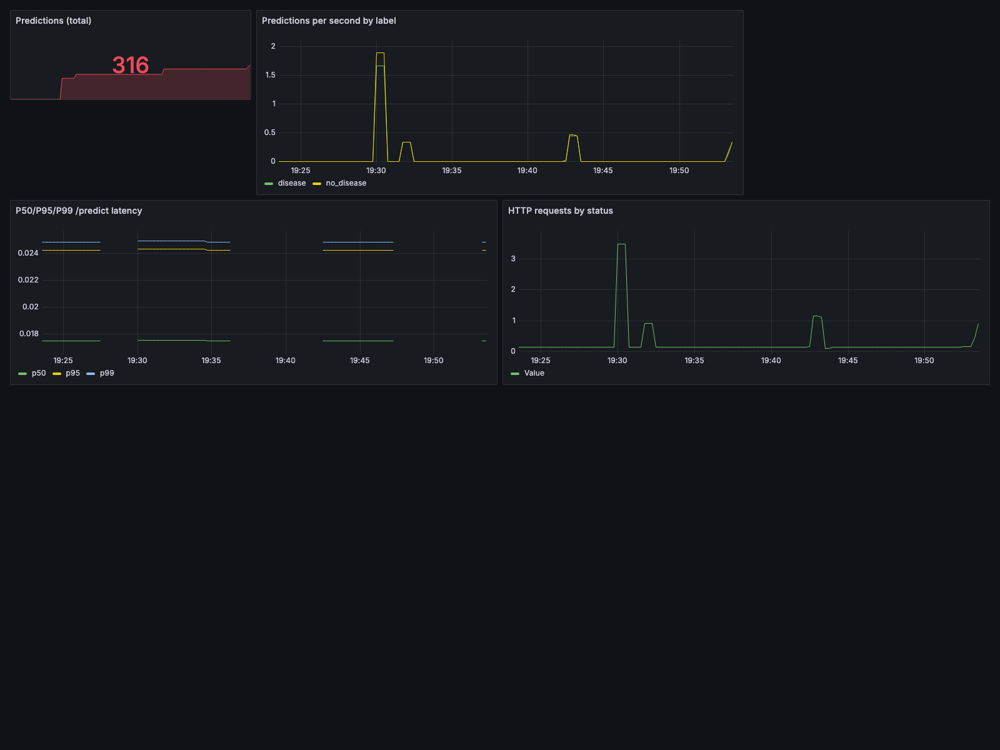

*Figure: live Grafana dashboard — total predictions, per-label rate, P50/P95/P99
latency and HTTP status codes.*

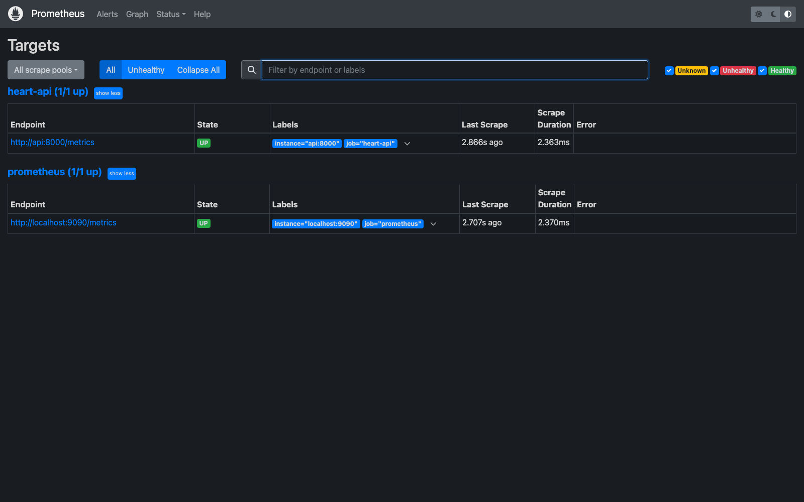

*Figure: Prometheus scraping the API `/metrics` endpoint (target UP).*

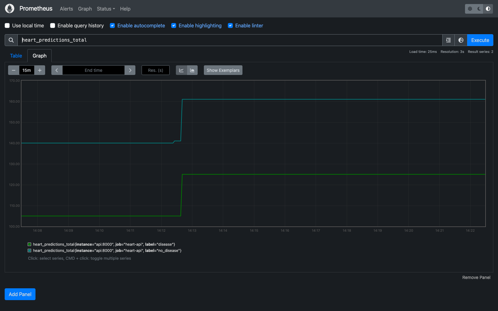

*Figure: `heart_predictions_total` plotted in the Prometheus expression browser.*

Raw metric/logging evidence: `screenshots/evidence/13_monitoring.txt` (PromQL query
results) and `screenshots/evidence/14_request_logging.txt` (structured request logs).

## 11. Architecture diagram

The end-to-end architecture is defined as code in `docs/architecture.mmd` (Mermaid
`flowchart`) covering: local development → experiment tracking (MLflow) → CI/CD
(GitHub Actions) → packaging (model + image) → Kubernetes runtime (Deployment,
Service, Ingress, HPA) → observability (Prometheus + Grafana). Render it to SVG/PNG
with any Mermaid renderer (e.g. `npx @mermaid-js/mermaid-cli -i docs/architecture.mmd
-o docs/architecture.png`) or paste it into <https://mermaid.live>.

## 12. Deliverables checklist

- [x] GitHub repository with code, Dockerfile(s), `requirements.txt`
- [x] Cleaned dataset (`data/raw/heart_disease_uci.csv`) + `data/download_data.py`
- [x] Jupyter notebooks + scripts (`notebooks/01_eda.ipynb`, `notebooks/02_model_dev.ipynb`, `src/train.py`, `src/predict.py`)
- [x] `tests/` folder with pytest suite (16 tests)
- [x] GitHub Actions workflow YAML (`.github/workflows/ci.yml`)
- [x] Kubernetes manifests + Helm chart
- [x] `screenshots/evidence/` folder (Swagger, MLflow, Prometheus, Grafana + text logs)
- [ ] Final written report (this document, exported to DOCX/PDF)
- [x] API access instructions (local — Section 2, Section 8, Section 9)
- [ ] Short video recording of the pipeline

## 13. Academic integrity statement

This submission was authored independently by Kanna TJ (2024ad05219@wilp.bits-pilani.ac.in). All
feature engineering choices, model grids, CI/CD steps, container layout, Kubernetes
manifests, monitoring configuration and documentation reflect original work. External
libraries used are cited via `requirements.txt` and are standard MLOps tooling.
